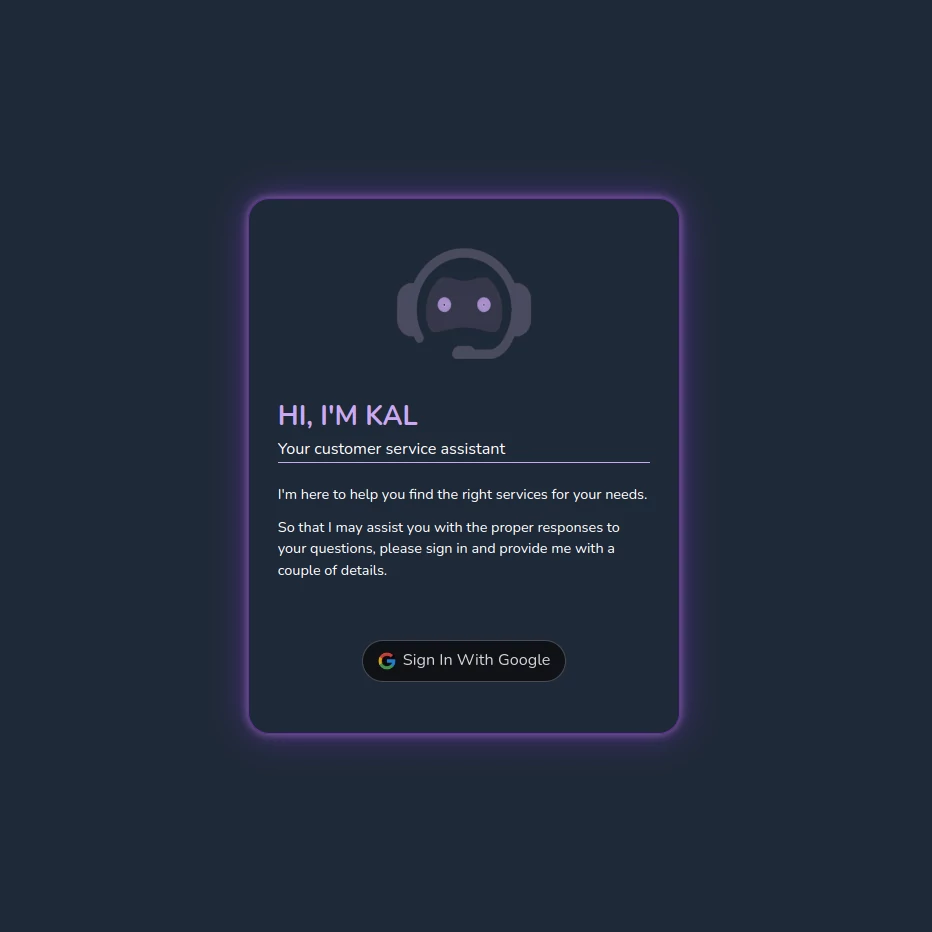
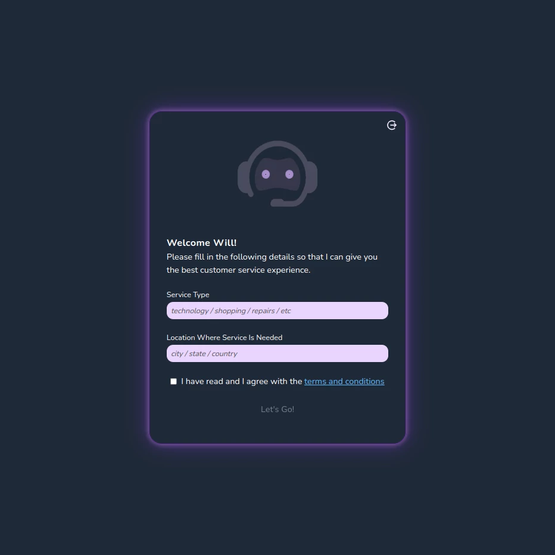
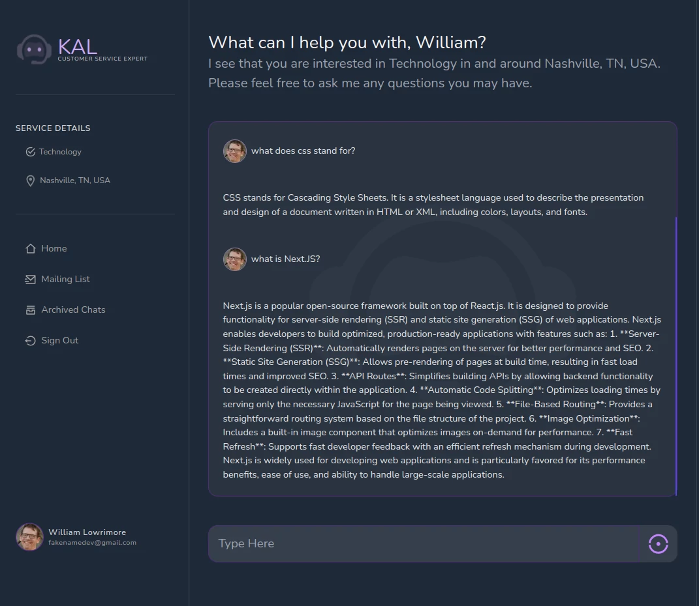

This project uses [`next/font`](https://nextjs.org/docs/basic-features/font-optimization) to automatically optimize and load Nunito Sans, a custom Google Font.

## Deployed on Vercel

Visit KAL [here](https://headstarter-p2-pantry-tracker.vercel.app/).

## Technologies Used

- [Next.js](https://nextjs.org)
- [NextAuth](https://nextauth.com)
- [Shadcn](https://shadcn.com)
- [Open AI](https://platform.openai.com)
- [Langchain](NPM)

## Resources

- [NextJS Docs](https://https://nextjs.org/docs)
- [Next Auth Docs](https://https:nextauth.com/docs)
- [Shadcn Docs](https://shadcn.com/docs)
- [Google Docs](https://docs.google.com)
- [OpenAI Docs](https://platform.openai/docs)
- [Codeium AI](https://codeium.com)
- [Gemini AI](https://gemini.google.com)

## Contact Contributors

### William Lowrimore (Frontend and OpenAI)

- [wlowrimore@gmail.com](mailto://wlowrimore@gmail.com)
- [github/wlowrimore](https://github.com/wlowrimore)
- [williamlowrimore.com](http://williamlowrimore.com)
- [linkedIn/william-lowrimore-dev](https://linkedin.com/in/william-lowrimore-dev)

### Muhammad Amir (Frontend and OpenAI)

- [7mramir@google.com](mailto://7mramir@google.com)

### Afrah Kausar (RAG AWS)

- [afrahkausar2020@gmail.com](mailto://afrahkausar2020@gmail.com)
